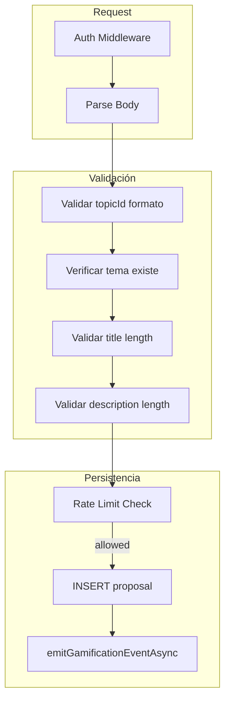

# Análisis de Seguridad: Plan Contrapropuestas
## Filosofía Zero Trust y Security First

Este documento analiza el [plan de habilitación de Contrapropuestas](/.cursor/plans/habilitar_contrapropuestas_d6abb664.plan.md) desde la perspectiva Zero Trust y Security First, alineado con el [Plan de acción global](docs/PLAN%20SEGU%20Y%20USAB/Plan%20de%20accion%20global.md) y los controles B1, B2, B3.

---

## 1. Resumen ejecutivo

El plan actual tiene varios puntos sólidos (autenticación en `/api/*`, rate limit existente) pero **omite controles críticos** que deben añadirse antes o durante la implementación para cumplir con Zero Trust y Security First.

---

## 2. Gaps de seguridad identificados

### 2.1 Validación y sanitización de entradas (Fase 1 y 3)

| Gap | Riesgo | Recomendación |
|-----|--------|---------------|
| **Sin límites de longitud** | DoS: strings gigantes en memoria/localStorage | Definir máximos: `title` ≤ 200 chars, `description` ≤ 2000 chars. Recortar con `String.slice()` tanto en frontend como backend. |
| **Sin sanitización explícita** | XSS futuro si se añade rich text o markdown | Hoy React escapa `{variable}` en JSX; es suficiente para texto plano. Si en el futuro se usa `dangerouslySetInnerHTML` o `<SafeHtml>`, exigir que `title` y `description` pasen por `sanitizeHtml()` antes de renderizar. Documentar esta política. |
| **Validación solo en frontend (Fase 1)** | Usuario puede manipular payloads (DevTools, peticiones directas) | En Fase 3, **todas** las validaciones deben replicarse en el backend. Frontend es UX; backend es la frontera de seguridad. |

### 2.2 Zero Trust: identidad del autor

| Gap | Riesgo | Recomendación |
|-----|--------|---------------|
| **`author` desde cliente o "Anónimo"** | Suplantación de identidad: el usuario podría enviar cualquier nombre | En backend: **nunca confiar en `author` del body**. Obtener siempre desde `c.get('user')` + perfil: `displayName` o `username`. Si el perfil no tiene, usar un valor seguro como `"Usuario"` o el `userId` ofuscado. |
| **Plan sugiere `author` en body** | Viola "never trust the client" | Eliminar `author` del contrato del endpoint. El backend deriva la identidad del token JWT verificado. |

### 2.3 Validación de `topicId` / `threadId`

| Gap | Riesgo | Recomendación |
|-----|--------|---------------|
| **Falta formato de ID** | Inyección o IDs malformados | Validar que `topicId` cumpla un patrón seguro (ej. `^[a-zA-Z0-9_-]+$` y longitud ≤ 64). Rechazar con 400 si no cumple. |
| **Existencia del tema** | Crear propuestas en temas inexistentes | Consultar `SELECT 1 FROM topics WHERE id = ?` antes de insertar. 404 si no existe. |
| **En Fase 1 (mock)** | `threadId` inyectado desde estado React | Verificar que `threads.some(t => t.id === contrapropuestaThreadId)` antes de modificar. Evitar inyección en estructuras derivadas. |

### 2.4 Generación de IDs

| Gap | Riesgo | Recomendación |
|-----|--------|---------------|
| **`'p' + Date.now()`** | Predecible; riesgo de colisión en alta concurrencia | Usar `crypto.randomUUID()` (navegador) o `crypto.randomUUID()` (Cloudflare Workers). En backend, el DB puede generar el ID o usar UUID. |
| **Fase 3: ID del backend** | Confiar en que el backend genera IDs seguros | Usar `crypto.randomUUID()` o equivalente. No exponer IDs secuenciales que revelen volumen de datos. |

### 2.5 Autorización y control de acceso

| Gap | Riesgo | Recomendación |
|-----|--------|---------------|
| **Cualquier usuario autenticado puede crear en cualquier tema** | Abuso masivo en temas sensibles o futuros temas privados | Por ahora, si todos los temas son públicos y editables, puede ser aceptable. Documentar que si se añaden temas privados o moderados, se debe implementar RBAC: verificar que el usuario tenga permiso para ese `topicId`. |
| **Rate limit solo por acción** | 2 propuestas/día por usuario; suficiente para mitigar spam | Mantener. Considerar límite por tema si se detecta abuso (ej. max N propuestas por usuario por tema por día). |

### 2.6 Orden de operaciones y consistencia (Fase 3)

| Gap | Riesgo | Recomendación |
|-----|--------|---------------|
| **Rate limit antes de validación de body** | Consumir cuota con peticiones inválidas | Validar body primero (longitud, tipos). Consumir rate limit solo si la petición es válida. Evita desperdiciar cuota con payloads mal formados. |
| **Orden sugerido** | - | 1) Auth (middleware); 2) Parse body; 3) Validar formato/longitud; 4) Verificar que tema existe; 5) Rate limit; 6) Insert; 7) Gamificación. |

### 2.7 Exposición de errores e información sensible

| Gap | Riesgo | Recomendación |
|-----|--------|---------------|
| **Mensajes genéricos** | El plan no detalla respuestas de error | Usar `ValidationError` con mensajes genéricos para el cliente (ej. "Datos inválidos"). No exponer detalles de schema ni queries. El `createErrorHandler` existente ya mitiga esto; mantener el patrón. |
| **Logs en servidor** | Evitar logs de datos de usuario en producción | No loguear `title`, `description` ni `author` completos. Solo IDs y códigos de error si es necesario para debugging. |

---

## 3. Checklist de implementación segura

### Fase 1 (Frontend mock)

- [ ] Validar `newContrapropuestaTitle`: trim, longitud ≤ 200, no vacío después de trim.
- [ ] Validar `newContrapropuestaDesc`: trim, longitud ≤ 2000, no vacío después de trim.
- [ ] Verificar que `contrapropuestaThreadId` exista en `threads` antes de añadir propuesta.
- [ ] Generar ID con `crypto.randomUUID()` en lugar de `'p' + Date.now()'.
- [ ] Mantener `author` como valor derivado (perfil o "Anónimo") solo en mock; documentar que en backend será siempre del servidor.

### Fase 3 (Backend)

- [ ] Validar `topicId`: regex seguro, longitud, existencia en DB.
- [ ] Validar body: `title` (required, ≤ 200), `description` (required, ≤ 2000). No aceptar `author` del body.
- [ ] Obtener autor desde `getProfileByUserId(db, userId)` → `displayName` o `username`; fallback seguro.
- [ ] Consumir rate limit solo tras validaciones exitosas.
- [ ] Usar consultas preparadas (`.bind()`) para evitar inyección SQL.
- [ ] Generar `proposalId` con `crypto.randomUUID()`.
- [ ] Responder con mensajes de error genéricos; no filtrar información sensible en logs.

---

## 4. Diagrama: flujo seguro (Fase 3)

---

## 5. Referencias

- `src/client/utils/sanitize.js`: DOMPurify para HTML futuro.
- `src/server/errors.ts`: `ValidationError` para respuestas 400.
- `src/server/middlewares/auth.middleware.ts`: JWT + allowlist.
- `docs/PLAN SEGU Y USAB/Plan de accion global.md`: Zero Trust, B1–B3.
